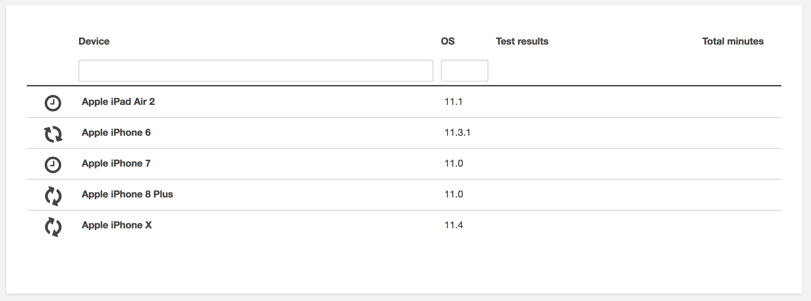

# Lab - XCTestUI Sample Tests for AWS Device Farm

This lab will walk you through executing an XCTest UI test suite that tests some basic functionalities of the AWS Device Farm iOS [sample app](https://github.com/awslabs/aws-device-farm-sample-app-for-ios).

## Getting Started
In order to run this app within Device Farm you will need an active AWS account with access to the us-west-2 (Oregon) region.

#### Download the App + Runner
For the purposes of this lab, the artifacts have already been generated for you and can be found under the "Releases" section of this repository: https://github.com/nspottsie/aws-device-farm-xctest-ui-lab/releases

You will need to download the "App.ipa" and "Runner.ipa" binaries. Remember the download location as you will need it when uploading the artifacts to Device Farm.

#### Running the Tests

1. Login to your AWS account, select Device Farm in the us-west-2 (Oregon) region 
1. Enter "iOS" as the name of the new project, click "Create Project" 
1. Click the "Create a new run" button 
1. Select the "Apple" icon, drop the App.ipa archive on the upload target and wait for the upload to complete 
1. When the upload completes, the screen should look like the image below. Click "Next step" 
1. Select "XCTest UI" for the Test field 
1. Drop the Runner.ipa on the upload target and wait for the upload to complete 
1. When the upload completes, the screen should look like the image below. Click "Next step" 
1. By default, the application will be compatible with a default pool of Top Devices. (Note: We will use the default "Top Devices" for the Lab, but you will want to configure your own pool of target devices depending on your specific testing requirements.) Click "Next step" 
1. We will use the default device state for this test run. Take note of the various options available to further customize your own future test runs. Click "Next step" 
1. We will use the default Execution timeout settings. Verify that the summary information is correct and click "Confirm and start run"
1. The App.ipa run will show up on the main Device Farm dashboard. Click the row to see more detailed status of the test run 
1. The test suite will now run independently on each device in the pool. This can take anywhere from 5-10 minutes per device, so get up and grab a drink or answer some emails. 
1. All tests and the lab are now complete. Using the managment console, you can drill into the specific test results per device, read logs, and view screen shots from the run. 

See the official AWS Device Farm documentation on [XCTest UI Testing](http://docs.aws.amazon.com/devicefarm/latest/developerguide/test-types-ios-xctest-ui.html) for more information.

## (Optional) Building From Source
When building the sample application from the source code provided, XCode will produce both an Application binary and a Test Runner binary. Each binary will need to be placed into an empty "Package" directory, zipped, and the extension changed from .zip to .ipa. See commands below for more information.

#### Building Project with Xcode 9.x
1. Select the `AWSDeviceFarmiOSReferenceApp` target.
2. Select `Generic iOS Device` as our build target.
3. Click `Product > Build For > Testing`.

Note: You may need to edit the build settings to select a development team and provisioning profile for the build to succeed.

#### Packing the Application and Test Runner
1. Go into your build directory: ```~/Library/Developer/Xcode/DerivedData/<Project Name>/Build/Products/Debug-iphoneos``` or if you have a custom build directory, go to that location.
2. Create a new directory named "Payload"
3. Copy the "Runner" file into the "Payload" folder
4. Right click the Payload folder > Compress.
5. Rename "Payload.zip" to "Runner.ipa".
6. Clean out the Payload directory so it is empty
3. Move the "Application" file into the "Payload" folder
4. Right click the Payload folder > Compress.
5. Rename "Payload.zip" to "App.ipa".
